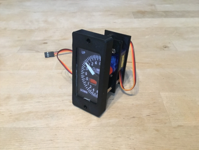
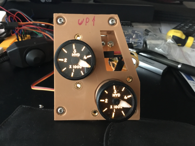
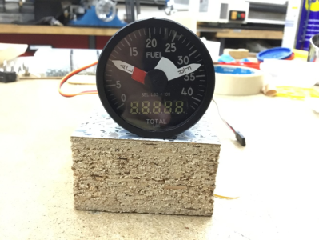

# Instruments used in my F-16 Simulator

This repository has been created to hold all the files I used to create the instrument's hardware for my [F-16 simulator](http://f16simulator.net)  
The Arduino part is in seperate repositories, since one Arduino controls more instruments. Those repos are linked in the README of each instrument.

Other instruments, once finished, will be added to this list.

  
[ALTIMETER](https://github.com/mihi4/F-16Altimeter)
(own repo because added before)

***

  
[VVI/AOA](vvi_aoa)

***
  
[HYDPRESS](hydpress)

***

  
[FQI](fuelgauge)

***

## !!! Use those files at your own risk !!!

All the files are free to use under the GNUGPLv3

If you find those files useful and would like to support me with an icecream, coffee or pizza, you can use paypal.me to do so ;)  
[Paypal.me](https://paypal.me/MichiHirczy)

